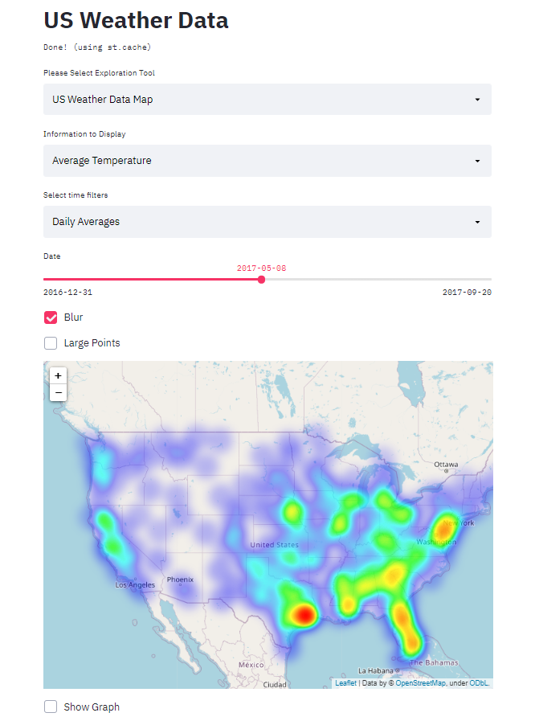

# US Weather Data Mapping

For this project I wanted to create visualizations that allow for the direct comparison of weather amongst different states in the continental United States. To do this I watned to create tools that allow different weather phenomenon such as temperature and precipitation to be directly compared between different states and analyzed thoroughly for individual states. 

## Project Goals

The main goal of this project was to develop a tool that allows a user to compare the weather patterns of differnt states. I wanted to give users the oppurtunity to find where in the US they could expect to find their ideal weather based on a number of factors. 

## Design

The first endcoding I wanted to explore was a geographic heat map. I wanted to use this because the project involved comparing different states and found that maps were the best way to visualize states. Furthermore, weather is likely going to be more similar based on the spatial distance from each other. The map was a useful tool for seeing the general trends across the country, however, it was difficult to compare locations that were further apart from one another. This lead to the decision to build graphs that display the top or bottom n data points from the map based on user inputs. THe graph displays accompanying the map were challenging because at low n number of states to display there was very little difference between bars, but at high n number of states it becomes harder to read. This informed the deciison to allow a user to change these as they desired. 

The next portion of the project involves individually analyzing states based on their temperature. For this part of the project I wanted to explore temperature stability. Specifically, there were two things I wanteed to exlpore more in depth: how much the tempoeratrure changes within a day and how much does the temperature change between seasons throughout the year. For this portion of the project it made sense to focus only on a single state at a time to see how temperature changes over time. The two measured areas were the average temperature within a day and the difference betwwen maximum and minimum temperatures in a day, which created two different scatter plots which the user can select which to display at a time. The scatterplots suffered from having a lot of noise. Two updates were added to help solve the issue of noisy data. The first is to group the datapoints into bins for each month. The second was to add a treadline to the scatter plot to easily display the general trends in the data.

The third tool focusesd on filtering the states based on weather criteria. This tool included several sliders taht can be used to filter the states based on the maximum temperatures, minimum temperatures, average daily temperature change (temperature stability), max rainfall, and max snowfall. This tool provides a list of states that match the the user input criteria. This tool gives users the ability to search for states that match their ideal weather conditions. 

## Development

Overall this implementation required approximately 15 man-hours of work. The application was built as a step by step process with new tools being developed to provide insights and improve the shortcomings of previous models. The map was useful for seeing a general overview, but lacked specificity and the ability to easily compare geographically desperate locations. THe State Analysis tool provided depth that the map could not display, but still made it difficult to compare states against one another. The final tool helps compare different states with eachother. 

The most time consuminig portions of this project were improving the aesthetics/labels for the graphics and finding effective ways to display temperature stability. There were two metrics I fanted to effectively display: how much temperature changes within a day, and how much temperature changes within a year. It was relatively easy to find ways to display how temperature changes throughout the year since seasons are associated with lower or higher temperatures for basically any location. How much temperature changes within a day is much more difficult to understand because there are not strong trends over time. Daily temperature stability is more associated geography than with time. For example closeness to bodies of water or mountains usually mean more stable temperatures within a day, whereas deserts and plains tend to have more temperature changes within a day. This made itdifficult to find ways to effetively compare daily temperaure change amongst states. I generally worked with Max temperature - Min temperature with this problem, but thiese displays often were noisy and confusng. I tried several techniques such as normalizing the data, removing outliers, binning data or by calculating standard deviation. 

Another design problem I faced when creating the map was that the heatmap appeared more intense in locations where the temperature readings were more close to eachother geographically. This became even more extreme when blur was applied to the datapoints since in densely popuilated areas these points would begin to overlap when viewing the map. I fixed this in part by removing some stations from the dataset that covered the same location (for example laguargdia airport, JFK, Long Island, and Central Park all had stations reporting weather despite their geopgraphic closeness to one another). 

## Success Story

An interesting insight I made by using this application was looking at what states seem to have the most stable temperatures. Generally, I assumes that the west coast would have very little temperature change within a day and within a year compared to other states. While California showed the second least change in temperature over the course of a year and the other two westr coast states, oOregon and Washington were in teh bottom twenty for change in a year, these states did not have very stable daily temperatures. In both daily temperature stability and annual temperature stability the east coast seemed to perform the best. The only states to be in the bottom 10 for temperature change both daily and annually were Florida, Louisiana, and Pennsylvania. I found this surprising as these states were nto necessarily associated with stable climates. As I looked more deeply into this I found that these states seem to have high amounts of pprecipitation compared to oter states (snow and rainfall) whereas the west coast states did have lower amounts of precipitation. THis may indicate that the common association with stable climates is more associated with lack of rain/storms rather than stable temperatures. 
